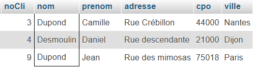

-- ----------------------------------------------------------------------------------------------------------------
Partie 1 : creation de la base de donnees 
-- ----------------------------------------------------------------------------------------------------------------

CREATE DATABASE IF NOT EXISTS location_ski;
USE location_ski;


CREATE TABLE IF NOT EXISTS clients (
    noCli INT NOT NULL PRIMARY KEY,
    nom VARCHAR(30) NOT NULL,
    prenom VARCHAR(30) NOT NULL,
    adresse VARCHAR(120) NOT NULL,
    cpo VARCHAR(5) NOT NULL,
    ville VARCHAR(80) NOT NULL
);


CREATE TABLE IF NOT EXISTS fiches (
    noFic INT NOT NULL PRIMARY KEY,
    noCli INT NOT NULL,
    dateCrea DATE NOT NULL,
    datePaiement DATE,
    etat ENUM('SO', 'EC', 'RE') NOT NULL,
    FOREIGN KEY (noCli) REFERENCES clients(noCli)
);


CREATE TABLE IF NOT EXISTS tarifs (
    codeTarif CHAR(5) NOT NULL PRIMARY KEY,
    libelle VARCHAR(30) NOT NULL,
    prixJour DECIMAL(5, 0) NOT NULL
);


CREATE TABLE IF NOT EXISTS gammes (
    codeGam CHAR(5) NOT NULL PRIMARY KEY,
    libelle VARCHAR(45) NOT NULL
);


CREATE TABLE IF NOT EXISTS categories (
    codeCate CHAR(5) NOT NULL PRIMARY KEY,
    libelle VARCHAR(30) NOT NULL
);


CREATE TABLE IF NOT EXISTS grilleTarifs (
    codeGam CHAR(5) NOT NULL,
    codeCate CHAR(5) NOT NULL,
    codeTarif CHAR(5) NOT NULL,
    PRIMARY KEY (codeGam, codeCate, codeTarif),
    FOREIGN KEY (codeGam) REFERENCES gammes(codeGam),
    FOREIGN KEY (codeCate) REFERENCES categories(codeCate),
    FOREIGN KEY (codeTarif) REFERENCES tarifs(codeTarif)
);


CREATE TABLE IF NOT EXISTS articles (
    refart CHAR(8) NOT NULL PRIMARY KEY,
    designation VARCHAR(80) NOT NULL,
    codeGam CHAR(5) NOT NULL,
    codeCate CHAR(5) NOT NULL,
    FOREIGN KEY (codeGam) REFERENCES gammes(codeGam),
    FOREIGN KEY (codeCate) REFERENCES categories(codeCate)
);


CREATE TABLE IF NOT EXISTS lignesFic (
    noLig INT NOT NULL,
    noFic INT NOT NULL,
    refart CHAR(8) NOT NULL,
    depart DATE NOT NULL,
    retour DATE,
    PRIMARY KEY (noFic, noLig),
    FOREIGN KEY (noFic) REFERENCES fiches(noFic),
    FOREIGN KEY (refart) REFERENCES articles(refart)
);


-- ----------------------------------------------------------------------------------------------------------------
PARTIE 2 : 
-- ----------------------------------------------------------------------------------------------------------------

1️⃣ Liste des clients (toutes les informations) dont le nom commence par un D

```sql
SELECT *
FROM clients
WHERE nom LIKE 'D%';





2️⃣ Nom et prénom de tous les clients

SELECT nom, prenom
FROM clients;


3️⃣ Liste des fiches (n°, état) pour les clients (nom, prénom) qui habitent en Loire Atlantique (44)

SELECT 
    fiches.noFic, 
    fiches.etat, 
    clients.nom, 
    clients.prenom
FROM 
    fiches
JOIN 
    clients 
ON 
    fiches.noCli = clients.noCli
WHERE 
    clients.cpo LIKE '44%';

4️⃣ Détail de la fiche n°1002

SELECT 
    f.noFic, 
    c.nom, 
    c.prenom, 
    lf.refart, 
    a.designation, 
    lf.depart, 
    lf.retour, 
    t.prixJour, 
    DATEDIFF(COALESCE(lf.retour, CURDATE()), lf.depart) * t.prixJour AS montant
FROM fiches f
JOIN clients c ON f.noCli = c.noCli
JOIN lignesFic lf ON f.noFic = lf.noFic
JOIN articles a ON lf.refart = a.refart
JOIN grilleTarifs gt ON a.codeGam = gt.codeGam AND a.codeCate = gt.codeCate
JOIN tarifs t ON gt.codeTarif = t.codeTarif
WHERE f.noFic = 1002;

5️⃣ Prix journalier moyen de location par gamme

SELECT 
    g.libelle AS 'Gamme',
    AVG(t.prixJour) AS 'Prix journalier moyen'
FROM 
    grilleTarifs gt
JOIN 
    gammes g ON gt.codeGam = g.codeGam
JOIN 
    tarifs t ON gt.codeTarif = t.codeTarif
GROUP BY 
    g.libelle

6️⃣ Détail de la fiche n°1002 avec le total

SELECT 
    f.noFic, 
    c.nom, 
    c.prenom, 
    lf.refart, 
    a.designation, 
    lf.depart, 
    lf.retour, 
    t.prixJour, 
    (DATEDIFF(COALESCE(lf.retour, CURDATE()), lf.depart) + IF(lf.retour IS NOT NULL, 1, 0)) * t.prixJour AS Montant,
    SUM((DATEDIFF(COALESCE(lf.retour, CURDATE()), lf.depart) + IF(lf.retour IS NOT NULL, 1, 0)) * t.prixJour) OVER () AS Total
FROM fiches f
JOIN clients c ON f.noCli = c.noCli
JOIN lignesFic lf ON f.noFic = lf.noFic
JOIN articles a ON lf.refart = a.refart
JOIN grilleTarifs gt ON a.codeGam = gt.codeGam AND a.codeCate = gt.codeCate
JOIN tarifs t ON gt.codeTarif = t.codeTarif
WHERE f.noFic = 1002;


7️⃣ Grille des tarifs

SELECT 
    g.libelle AS 'Gamme',
    c.libelle AS 'Catégorie',
    t.libelle AS 'Type de tarif',
    t.prixJour AS 'Prix journalier (€)'
FROM 
    grilleTarifs gt
JOIN 
    gammes g ON gt.codeGam = g.codeGam
JOIN 
    categories c ON gt.codeCate = c.codeCate
JOIN 
    tarifs t ON gt.codeTarif = t.codeTarif
ORDER BY 
    g.libelle, c.libelle, t.prixJour;


8️⃣ Liste des locations de la catégorie SURF 

SELECT 
    a.refart,
    a.designation,
    COUNT(l.noLig) AS nbLocation
FROM 
    articles a
JOIN 
    lignesFic l ON a.refart = l.refart
WHERE 
    a.codeCate = 'SURF'
GROUP BY 
    a.refart, a.designation;

9️⃣ Calcul du nombre moyen d’articles loués par fiche de location

SELECT 
    AVG(article_count) AS 'nb_lignes_moyen_par_fiche'
FROM (
    SELECT 
        noFic, 
        COUNT(refart) AS article_count
    FROM 
        lignesFic
    GROUP BY 
        noFic
) AS fiche_counts;

10 - Calcul du nombre de fiches de location établies pour les catégories de location Ski alpin, Surf et Patinette

SELECT 
    c.libelle AS categorie, 
    COUNT(f.noFic) AS nombre_de_location
FROM 
    lignesFic l
JOIN 
    articles a ON l.refart = a.refart
JOIN 
    categories c ON a.codeCate = c.codeCate
JOIN 
    fiches f ON l.noFic = f.noFic
WHERE 
    c.libelle IN ('Ski alpin', 'Surf', 'Patinette')
GROUP BY 
    c.libelle;

11 Calcul du montant moyen des fiches de location

SELECT 
    AVG(total_par_fiche) AS montant_moyen
FROM (
    SELECT 
        f.noFic,
        SUM(t.prixJour * DATEDIFF(IFNULL(l.retour, NOW()), l.depart)) AS total_par_fiche
    FROM 
        lignesFic l
    JOIN 
        articles a ON l.refart = a.refart
    JOIN 
        grilleTarifs g ON a.codeGam = g.codeGam AND a.codeCate = g.codeCate
    JOIN 
        tarifs t ON g.codeTarif = t.codeTarif
    JOIN 
        fiches f ON l.noFic = f.noFic
    GROUP BY 
        f.noFic
) sous_requete;
